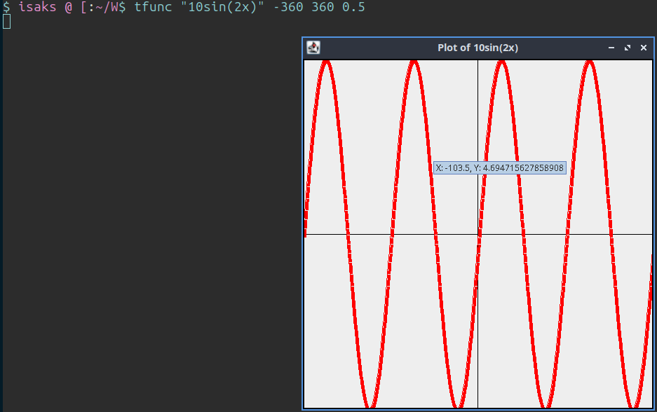
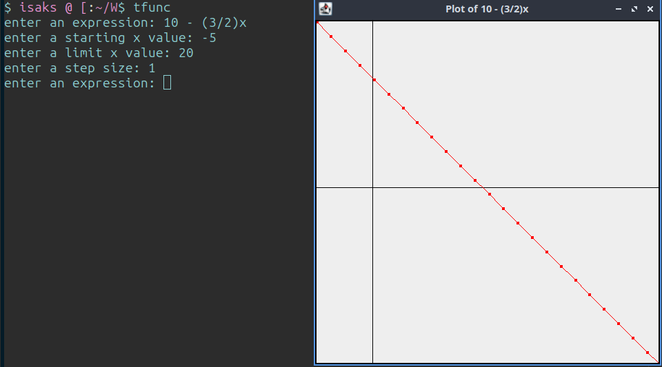
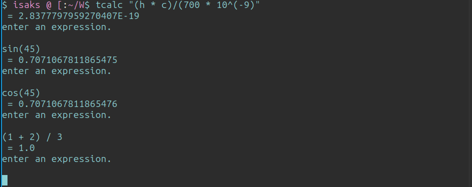

# Tcalc

Tcalc is a command-line calculator and plotter that can evaluate complex, parenthesised mathematical expressions. It can also plot functions. Hovering over a point in the graph displays the exact coordinates.

The project contains two seperate main functions: One to run the calculator, and one to run the plotting program. They both accept both args and interactive prompting.

I have configured bash aliases that excecute the .jar files in my bashrc: [Link to dotfiles repo](https://github.com/isak-s/dotfiles)
## Plotting 10*sin(2x)

## Plotting a linear equation

## Calculating the energy of a photon of red light with plancks constant and the speed of light

## Footnote and rant
The most common datastructure used for expression evaluation is a binary tree, where nodes are operators, and leaves are operands.

I wanted to learn more about stacks and recursion however, and therefore i set out to create an expression evaluator using a stack, from scratch.

The main challenge i faced was handling operator precedence. A binary tree does this naturally when evaluating a properly built structure, but when using a stack it becomes a bit more difficult..

My solution was to enclose all prioritized operations in parentheseses when they are pushed into the stack from a string. When the recursive algorithm then traverses the stack, it expects two operands and an operator. In the case of a parethesised expression, the resut from a recursive call becomes the operand.

In hindsight, I really think that a stack isn't the optimal data structure for a problem like this. Choosing the correct datastructure for a given problem, can make the problem dramatically easier--While choosing the wrong one can provide a fun challenge :)
